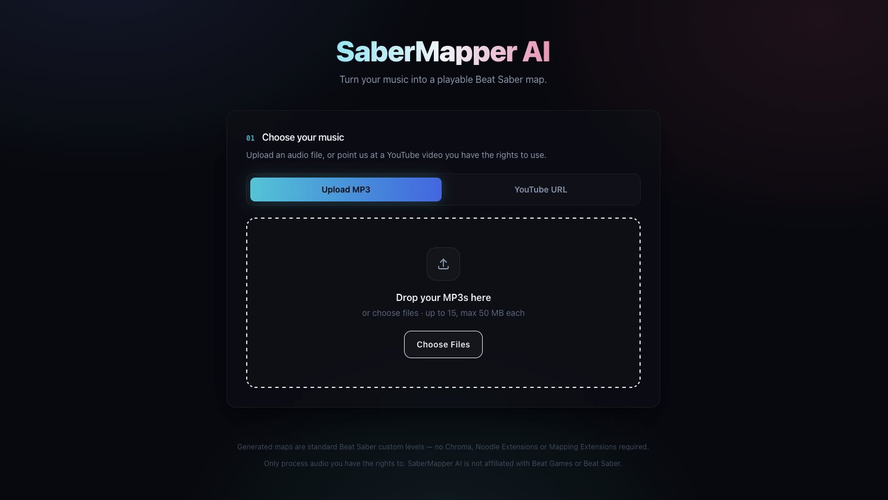

# SaberMapper AI

**Turn your music into a playable Beat Saber map.**

SaberMapper AI takes an MP3 or a YouTube link, analyses the actual audio, and
generates a Beat Saber custom level you can drop straight into your game.

It is not a random note generator. The pipeline detects the song's tempo,
finds its structure, builds a timeline of musical events, and then asks a
pattern engine — constrained by swing parity, hand travel and a difficulty
profile — how that music should be *performed*. The selected difficulty
changes how the music is represented, not merely how many blocks appear.



---

## Documentation

| | |
|---|---|
| [Architecture](docs/architecture.md) | How the pieces fit together |
| [The mapping engine](docs/mapping-engine.md) | How audio becomes notes |
| [Difficulty system](docs/difficulty.md) | What each difficulty means, and how it was calibrated |
| [API reference](docs/api.md) | The HTTP surface |
| [Local development](docs/development.md) | Running it outside Docker, config, tests |
| [Security and limitations](docs/security.md) | What it defends against, and what it gets wrong |

---

## What it does

```
MP3 / YouTube
     ↓
Audio acquisition        →  one interface, two adapters
     ↓
Normalisation            →  analysis.wav (DSP) + song.ogg (package)
     ↓
Audio analysis           →  BPM, beats, onsets, energy bands       ← runs once
     ↓
Structure analysis       →  intro / verse / drop / break …
     ↓
Musical event timeline   →  kick, snare, accent, downbeat …        ← reused
     ↓
┌─────────┬─────────┬─────────┬─────────┬───────────┐
Easy    Normal    Hard    Expert    Expert+                        ← per request
     ↓
Rhythm selection → Wall planning → Pattern generation → Parity check
     ↓
Difficulty control → Playability validation
     ↓
Beat Saber export → ZIP download
```

Everything above the fork happens **once per song**. Choosing a second
difficulty, a different style, or a new seed re-runs only the bottom half — no
re-upload, no re-analysis.

### Features

- MP3 upload (drag and drop) or YouTube URL
- Five difficulties: Easy, Normal, Hard, **Expert** (default), Expert+
- Three mapping styles: Balanced, Dance, Technical
- Intensity control that shapes the map *within* the chosen difficulty
- Deterministic seeds — same inputs always produce the same map
- Red/blue notes, directional cuts, conservative walls, vanilla lighting
- Real backend progress, structural validation, and a one-click ZIP

Generated maps are **plain vanilla levels**. No Chroma, Noodle Extensions,
Mapping Extensions or Cinema required.

---

## Quick start (Docker)

Requirements: Docker with Compose v2.

```bash
git clone git@github.com:monkeydouy/beatsaber-map-builder.git
cd beatsaber-map-builder
cp .env.example .env          # optional; every value has a working default
docker compose up --build
```

Then open:

| Service   | URL                            |
| --------- | ------------------------------ |
| Frontend  | http://localhost:3000          |
| API       | http://localhost:8000          |
| API docs  | http://localhost:8000/docs     |
| Health    | http://localhost:8000/api/health |

FFmpeg and yt-dlp are installed inside the API image, so nothing extra is
needed on the host.

**If port 3000 or 8000 is already in use**, override it:

```bash
WEB_PORT=3100 API_PORT=8100 \
ALLOWED_ORIGINS=http://localhost:3100 \
NEXT_PUBLIC_API_BASE_URL=http://localhost:8100 \
docker compose up --build
```

`NEXT_PUBLIC_API_BASE_URL` is compiled into the browser bundle, so changing it
requires rebuilding the `web` image. `ALLOWED_ORIGINS` must list the origin the
browser actually uses, or the API will (correctly) refuse the requests.

---

## Installing a generated map

The download is a standard Beat Saber custom level: `Info.dat`,
`<Difficulty>Standard.dat`, `song.ogg` and `cover.png`, at the **root** of the
ZIP.

1. Extract the ZIP into its **own folder** (e.g. `My Song (Expert)`).
2. Move that folder into your installation's custom levels directory.
3. Restart Beat Saber, or use your mod manager's refresh.

The custom levels directory depends on your platform, store and mod setup, so
there is no single correct path. Common locations:

- **Steam (Windows):** inside the game folder, under
  `Beat Saber_Data/CustomLevels`
- **Oculus/Meta PC:** the same subpath inside wherever the Oculus store
  installed the game
- **Quest (modded, BMBF/QuestPatcher):** the custom levels folder your patching
  tool manages — use its own import feature rather than copying by hand

If you use a mod manager or a map installer, importing the ZIP directly is
usually easier and safer than moving folders. When in doubt, check where your
existing custom songs live and put the folder beside them.

Requires the standard custom-levels support (SongCore). No other mods are
needed.

---

## Contributing

Three directories are deliberately absent from the repository. If something
looks like it is missing, this is why:

- **`examples/`** — extracted community Beat Saber levels, used to calibrate the
  generator against real human mapping. Those maps and that music belong to
  their authors, so they are not redistributed here. Point
  `services/mapper-api/tools/analyse_reference_maps.py` at a folder of your own.
- **`storage/`** — runtime data: every song anyone has uploaded, its analysis
  and its generated maps.
- **`.claude/`** — per-machine editor and agent state. `settings.local.json` in
  there accumulates whatever shell commands were approved on the machine,
  credentials included, so the whole directory stays out.

The audio fixture the tests run against is generated rather than committed:

```bash
cd services/mapper-api
python tests/fixtures/make_fixture.py tests/fixtures/test_song.wav
```

`tests/fixtures/ranked_corpus.json` *is* committed on purpose — it is the
measured evidence behind the difficulty profiles, and the calibration tests
read it.

---

## Legal

Only process audio you have the rights to. The YouTube tab requires an explicit
per-video confirmation that you have permission, and nothing is ever uploaded
or published anywhere.

SaberMapper AI is an independent project. It is not affiliated with, endorsed
by, or connected to Beat Games or Beat Saber, and it contains none of their
artwork or branding. Generated cover art is produced locally from your own
song's metadata.

The code is MIT licensed — see [LICENSE](LICENSE). That covers this software
only. It says nothing about the music you feed it or the maps you generate:
those remain subject to whatever rights apply to the source audio.
